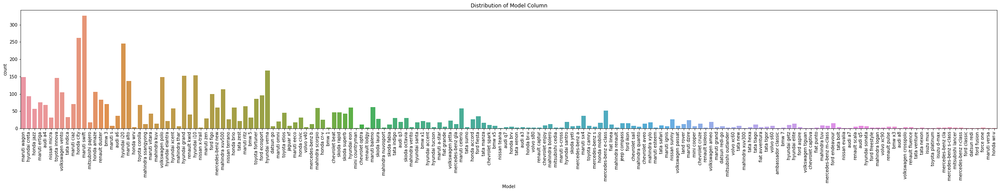
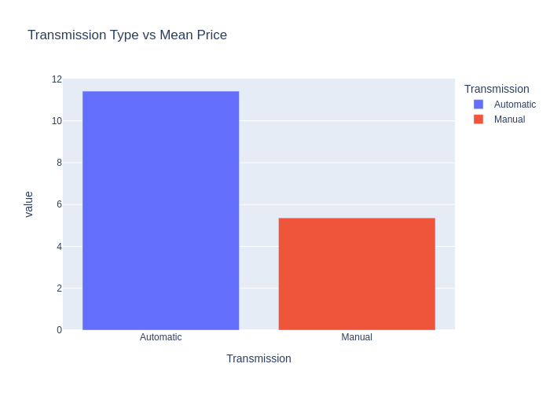
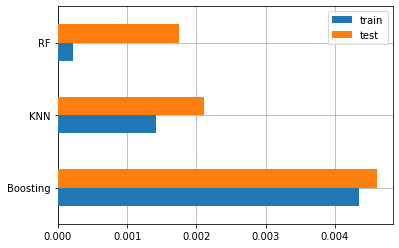

# Used Car Price Prediction

#### Disusun oleh : Moh. Iqbal Fatchurozi

Proyek ini membangun model machine learning yang dapat memprediksi harga mobil di India.

## Domain Proyek

### Latar Belakang

Mobil, sebagai kendaraan pribadi, memainkan peran penting dalam kehidupan manusia. Nilai dari setiap mobil tergantung pada merek, model, tahun produksi, jenis bahan bakar, kapasitas mesin, jumlah kilometer yang telah ditempuh, serta berbagai fitur dan spesifikasi lainnya.

 

<figcaption>Gambar 1. Mobil</figcaption>
 

Harga dari setiap mobil diukur dari nilai yang dimiliki oleh mobil tersebut. Namun, harga ini tidak selalu pasti dan sulit untuk melakukan prediksi akurat secara manual [1]. Faktor ketidakpastian perlu dikurangi oleh para penjual maupun pembeli dengan membangun sistem prediksi yang dapat menentukan berapa harga beli yang pantas untuk karakteristik mobil tertentu.

Dalam mencapai hal tersebut, maka dilakukan penelitian untuk memprediksi harga mobil menggunakan model machine learning. Diharapkan model ini mampu memprediksi harga sewa yang sesuai dengan harga pasar. Prediksi ini nantinya dijadikan acuan bagi penjual maupun pembeli dalam membeli moobil dengan harga yang tepat.

## Business Understanding

Proyek ini dibangun untuk penjual dengan karakteristik bisnis sebagai berikut :

- Perusahaan atau penjual mobil yang menjual mobil ke konsumen.
- Perusahaan atau penjual membuka jasa konsultasi harga jual mobil ke konsumen.

### Problem Statement

1. Karakteristik apa yang paling berpengaruh terhadap harga mobil?
2. Bagaimana cara memproses data agar dapat dilatih dengan baik oleh model?
3. Berapa harga jual mobil di pasaran berdasarkan karakteristik tertentu?

### Goals

1. Mengetahui karakteristik yang paling berpengaruh pada harga jual mobil.
2. Melakukan persiapan data untuk dapat dilatih oleh model.
3. Membuat model machine learning yang dapat memprediksi harga jual mobil seakurat mungkin berdasarkan karakteristik tertentu.

### Solution Statement

1. Menganalisis data dengan melakukan univariate analysis dan bivariate analysis. Memahami data juga dapat dilakukan dengan visualisasi. Memahami data dapat membantu untuk mengetahui kolerasi antar fitur dan mendeteksi outlier.
2. Menyiapkan data agar bisa digunakan dalam membangun model.
3. Melakukan hyperparameter tuning menggunakan grid search dan membangun model regresi yang dapat memprediksi bilangan kontinu. ALgoritma yang dipakai dalam proyek ini adalah K-Nearest Neighbour, Random Forest, dan AdaBoost.

## Data Understanding

Dataset yang digunakan dalam proyek ini merupakan data mobil yang ada di India. Dataset ini dapat diunduh di [Kaggle : Used Cars Price Prediction Dataset](https://www.kaggle.com/datasets/avikasliwal/used-cars-price-prediction).

Berikut informasi pada dataset :

- Dataset memiliki format CSV (Comma-Seperated Values).
- Dataset memiliki 6019 sample dengan 14 fitur.
- Dataset memiliki 3 fitur bertipe int64, 2 fitur bertipe float64 dan 9 fitur bertipe object.
- Tidak ada missing value dalam dataset.

### Variable - variable pada dataset

- Unnamed: 0: Index.
- Name: Merek dan model mobil.
- Location: Lokasi di mana mobil dijual atau tersedia untuk dibeli..
- Year: Tahun atau edisi model..
- Kilometers_Driven: Jumlah kilometer yang telah ditempuh oleh mobil.
- Fuel_Type: Jenis bahan bakar yang digunakan oleh mobil.
- Transmission: Jenis transmisi yang digunakan oleh mobil.
- Owner_Type: Apakah kepemilikannya adalah Tangan Pertama, Tangan Kedua atau pemilik lainnya.
- Mileage: Jarak tempuh mobil per liter bahan bakar.
- Engine: Kapasitas mesin mobil.

Dari ke 14 fitur dapat dilihat bahwa fitur Unnamed:0 tidak mempengaruhi harga jual mobil sehingga akan dihapus. Hal ini dikarenakan fitur tersebut tidak diperlukan dalam membangun model prediksi harga jual.

### Univariate Analysis

Univariate Analysis adalah menganalisis setiap fitur secara terpisah.

#### Analisis sebaran pada setiap fitur numerik

 
<figcaption>Grafik 1. Analisis Numerik (Univariate Analysis)</figcaption>

Berikut analisis dari grafik di atas :

- Sebagian besar mobil dibuat sekitar tahun 2015.
- Sebagian besar mobil mempunyai jumlah kilometer tempuh sebgian besar rentang 50000.
- Rentang harga jual cukup tinggi, yaitu dari 5K sampai 20K hingga 24K. Distribusi harga yang kurang bagus seperti ini dapat berimplikasi pada model.

#### Analisis sebaran pada setiap fitur kategorik

 
<figcaption>Grafik 2. Analisis Kategorik (Univariate Analysis)</figcaption>

Analisis : Sebagian besar mobil bermerk Maruti, Hyundai, Honda, Toyota, dan Mahindra.

### Bivariate Analysis

Bivariate Analysis adalah menganalisis setiap fitur secara berpasangan.

#### Analisis korelasi antar fitur numerik

- Year Vs Mean Price
  

<figcaption>Grafik 2. Year Vs Mean Price</figcaption> 

  Dari Grafik 2 dapat dilihat bahwa semakin baru tahun produksi mobil, maka harga jual mobil semakin tinggi.
- Kilometers Driven Vs Mean Price
  

<figcaption>Grafik 3. Kilometers Driven Vs Mean Price</figcaption> 

  Dari Grafik 3 dapat dilihat Semakin tinggi jumlah kilometer yang telah ditempuh oleh mobil, maka harga jual mobil semakin rendah.
- Fuel Type Vs Mean Price
  

<figcaption>Grafik 4. Fuel Type Vs Mean Price</figcaption> 

  Dari Grafik 4 Mobil dengan bahan bakar diesel memiliki harga jual yang lebih tinggi dibandingkan dengan bahan bakar lainnya.
- Transmission Vs Mean Price
  

<figcaption>Grafik 5. Transmission Type Vs Mean Price</figcaption> 

  Dari Grafik 5 Mobil dengan transmisi otomatis memiliki harga jual yang lebih tinggi dibandingkan dengan transmisi manual.
- Owner Type Vs Mean Price
  

<figcaption>Grafik 6. owner Type Vs Mean Price</figcaption> 

  Dari Grafik 6 dapat dilihat bahwa mobil dengan kepemilikan tangan pertama memiliki harga jual yang lebih tinggi dibandingkan dengan kepemilikan tangan kedua.
- Mileage Vs Mean Price
  

<figcaption>Grafik 7. Mileage Vs Mean Price</figcaption> 

  Dari Grafik 7 dapat dilihat semakin tinggi jarak tempuh mobil per liter bahan bakar, maka harga jual mobil semakin rendah.
- Engine Vs Mean Price
  

<figcaption>Grafik 8. Engine Vs Mean Price</figcaption> 

  Dari Grafik 8 dapat dilihat semakin besar kapasitas mesin mobil, maka harga jual mobil semakin tinggi.
- Power Vs Mean Price
  

<figcaption>Grafik 9. Power Vs Mean Price</figcaption> 

  Dari Grafik 9 dapat dilihat semakin besar daya mesin mobil, maka harga jual mobil semakin tinggi.
- Seats Vs Mean Price
  

<figcaption>Grafik 10. Seats Vs Mean Price</figcaption> 

  Dari Grafik 10 dapat dilihat bahwasanya semakin banyak jumlah kursi mobil, maka harga jual mobil semakin tinggi.
- Company Vs Mean Price
  

<figcaption>Grafik 11. Company Vs Mean Price</figcaption> 

  Dari Grafik 11 dapat dilihat bahwa mobil dengan merek Jeep memiliki harga jual yang lebih tinggi dibandingkan dengan merek lainnya.
- Location
  

<figcaption>Grafik 12. Location Vs Mean Price</figcaption> 

  Dari Grafik 11 dapat dilihat bahwa mobil yang dijual di kota Coimbatore memiliki harga jual yang lebih tinggi dibandingkan dengan kota lainnya.

## Data preparation

- One Hot Encoding

  One hot encoding adalah teknik mengubah data kategorik menjadi data numerik dimana setiap kategori menjadi kolom baru dengan nilai 0 atau 1. Fitur yang akan diubah menjadi numerik pada proyek ini adalah Location, Fuel_Type, Transmission, Company, dan Model.

- Train Test Split

  Train test split aja proses membagi data menjadi data latih dan data uji. Data latih akan digunakan untuk membangun model, sedangkan data uji akan digunakan untuk menguji performa model. Pada proyek ini dataset sebesar 4880 dibagi menjadi 3904 untuk data latih dan 976 untuk data uji.

- Normalization

  Algoritma machine learning akan memiliki performa lebih baik dan bekerja lebih cepat jika dimodelkan dengan data seragam yang memiliki skala relatif sama. Salah satu teknik normalisasi yang digunakan pada proyek ini adalah Standarisasi dengan sklearn.preprocessing.StandardScaler.

## Modeling

- Algoritma
  Penelitian ini melakukan pemodelan dengan 3 algoritma, yaitu K-Nearest Neighbour, Random Forest, dan

  - K-Nearest Neighbour
    K-Nearest Neighbour bekerja dengan membandingkan jarak satu sampel ke sampel pelatihan lain dengan memilih sejumlah k tetangga terdekat. Proyek ini menggunakan [sklearn.neighbors.KNeighborsRegressor](https://scikit-learn.org/stable/modules/generated/sklearn.neighbors.KNeighborsRegressor.html) dengan memasukkan X_train dan y_train dalam membangun model. Parameter yang digunakan pada proyek ini adalah :

    - `n_neighbors` = Jumlah k tetangga tedekat.

  - Random Forest
    Algoritma random forest adalah teknik dalam machine learning dengan metode ensemble. Teknik ini beroperasi dengan membangun banyak decision tree pada waktu pelatihan. Proyek ini menggunakan [sklearn.ensemble.RandomForestRegressor](https://scikit-learn.org/stable/modules/generated/sklearn.ensemble.RandomForestRegressor.html) dengan memasukkan X_train dan y_train dalam membangun model. Parameter yang digunakan pada proyek ini adalah :

    - `n_estimators` = Jumlah maksimum estimator di mana boosting dihentikan.
    - `max_depth` = Kedalaman maksimum setiap tree.
    - `random_state` = Mengontrol seed acak yang diberikan pada setiap base_estimator pada setiap iterasi boosting.

  - Adaboost
    AdaBoost juga disebut Adaptive Boosting adalah teknik dalam machine learning dengan metode ensemble. Algoritma yang paling umum digunakan dengan AdaBoost adalah pohon keputusan (decision trees) satu tingkat yang berarti memiliki pohon Keputusan dengan hanya 1 split. Pohon-pohon ini juga disebut Decision Stumps. Algoritma ini bertujuan untuk meningkatkan performa atau akurasi prediksi dengan cara menggabungkan beberapa model sederhana dan dianggap lemah (weak learners) secara berurutan sehingga membentuk suatu model yang kuat (strong ensemble learner). Proyek ini menggunakan [sklearn.ensemble.AdaBoostRegressor](https://scikit-learn.org/stable/modules/generated/sklearn.ensemble.AdaBoostRegressor.html) dengan memasukkan X_train dan y_train dalam membangun model. Parameter yang digunakan pada proyek ini adalah :
    - `n_estimators` = Jumlah maksimum estimator di mana boosting dihentikan.
    - `learning_rate` = Learning rate memperkuat kontribusi setiap regressor.
    - `random_state` = Mengontrol seed acak yang diberikan pada setiap base_estimator pada setiap iterasi boosting.

- Hyperparameter Tuning (Grid Search)
  Hyperparameter tuning adalah cara untuk mendapatkan parameter terbaik dari algoritma dalam membangun model. Salah satu teknik dalam hyperparameter tuning yang digunakan dalam proyek ini adalah grid search. Berikut adalah hasil dari Grid Search pada proyek ini :
  | model | best_params |
  |----------|-----------------------------------------------------------------|
  | knn | {'n_neighbors': 9} |
  | boosting | {'learning_rate': 0.1, 'n_estimators': 100, 'random_state': 55} |
  | rf | {'max_depth':64, 'n_estimators': 50, 'random_stste': 33} |

## Evaluation

Metrik evaluasi yang digunakan pada proyek ini adalah akurasi dan mean squared error (MSE). Akurasi menentukan tingkat kemiripan antara hasil prediksi dengan nilai yang sebenarnya (y_test). Mean squared error (MSE) mengukur error dalam model statistik dengan cara menghitung rata-rata error dari kuadrat hasil aktual dikurang hasil prediksi.

Berikut hasil evaluasi pada proyek ini :

- Akurasi
  | model | accuracy |
  |----------|----------|
  | knn | 0.907578 |
  | boosting | 0.799076 |
  | rf | 0.923833 |

- Mean Squared Error (MSE)
- 

<figcaption>Grafik 12. Mean Squared Error</figcaption> 

Dari hasil evaluasi dapat dilihat bahwa model dengan algoritma Random Forest memiliki akurasi lebih tinggi dan tingkat error lebih kecil dibandingkan algoritma lainnya dalam proyek ini.

## Conclusion

Dari hasil evaluasi yang dilakukan, dapat disimpulkan bahwa model dengan menggunakan algoritma Random Forest memberikan performa yang lebih baik dibandingkan dengan algoritma KNN dan Boosting dalam melakukan prediksi harga mobil. Model Random Forest memiliki akurasi sebesar 0.923833, yang lebih tinggi dibandingkan dengan akurasi KNN (0.907578) dan Boosting (0.799076).

Selain akurasi yang lebih tinggi, model Random Forest juga memiliki tingkat error yang lebih kecil, yang menunjukkan kemampuannya dalam mengurangi kesalahan prediksi. Hal ini menjadikan model Random Forest sebagai pilihan yang baik untuk digunakan dalam proyek ini untuk melakukan prediksi harga mobil.

Namun, penting untuk dicatat bahwa kesimpulan ini didasarkan pada evaluasi yang dilakukan dalam proyek ini. Ketika menerapkan model pada proyek atau situasi yang berbeda, hasilnya dapat bervariasi. Oleh karena itu, perlu dilakukan evaluasi tambahan dan penyesuaian model sesuai dengan kebutuhan dan karakteristik data yang spesifik.

## References

[1] Pandey, Abhishek and Rastogi, Vanshika and Singh, Sanika, Car’s Selling Price Prediction using Random Forest Machine Learning Algorithm (March 1, 2020). 5th International Conference on Next Generation Computing Technologies (NGCT-2019), Available at SSRN: https://ssrn.com/abstract=3702236 or http://dx.doi.org/10.2139/ssrn.3702236
